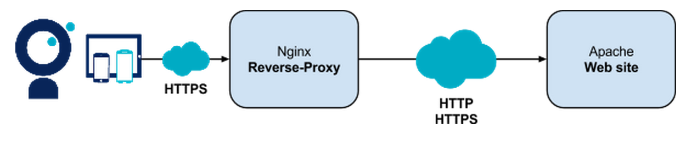
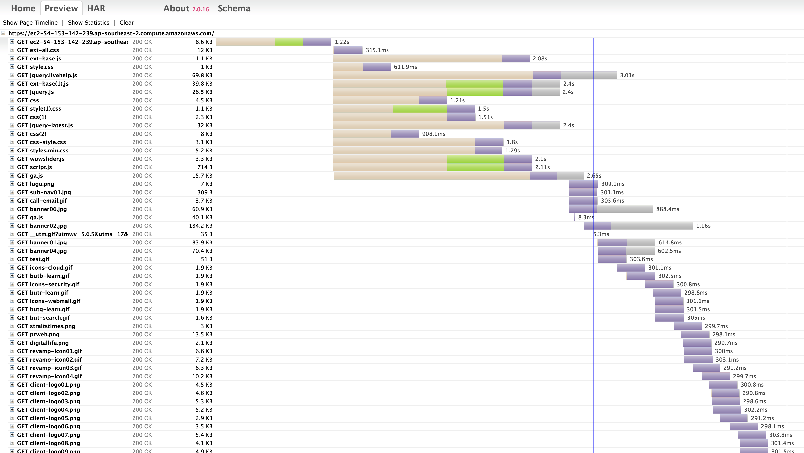
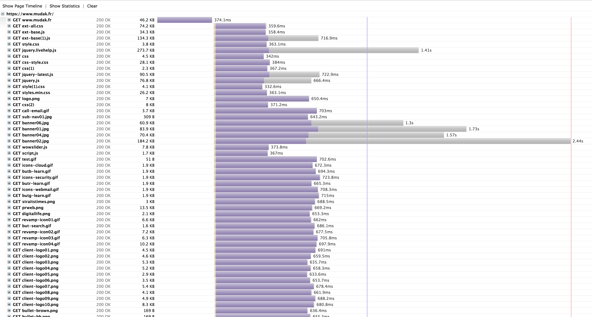

# Nginx, Reverse Proxy, SPDY, etc…

Bien souvent, vous êtes confrontés à des serveurs Web datant d’une autre époque (Apache pour ne pas le citer).

Je vous propose de vous initer à [Docker](https://www.docker.com/), [Ansible](http://www.ansible.com/home) et à NGINX : nous allons mettre en place un reverse-proxy Nginx dans un conteneur [Docker](https://www.docker.com/) qui sera en charge de proxifier un site tournant sur Apache que nous aurons déployé avec [Ansible](http://www.ansible.com/home).

AMA, [Docker](https://www.docker.com/) et [Ansible](http://www.ansible.com/home) sont en 2015 des pré-requis pour être efficace.

## Héberger notre site web sous Apache
L’intérêt de votre présence ici n’est pas de faire de l’Apache mais d’apprendre les bases d’[Ansible](http://www.ansible.com/home). Nous allons donc nous contenter d’installer Apache et de le configurer pour servir un répertoire contenant notre site statique.

Le site statique utilisé est un export d’une homepage d’un site existant mal optimisé pour être utile pour de futur tests: quelques CSS, quelques fichiers JS, un jQuery embarqué, une trentaine d’images.

Pour apprendre [Ansible](http://www.ansible.com/home) rapidement, je vous conseille cette page : [https://serversforhackers.com/an-ansible-tutorial](https://serversforhackers.com/an-ansible-tutorial). Elle m’a permis de me bootstraper rapidement dessus.

Le rôle [Ansible](http://www.ansible.com/home) fournit dans les sources a pour but de:
* installer Apache
* copier les fichiers du site statique
* déployer notre configuration Apache sur le serveur distant
* déployer des certificats pour l’exposition en SSL
* redémarrer le service Apache.

A la fin de l’exécution de ce rôle, vous vous retrouverez avec un Apache servant le site statique en HTTP et HTTPS sur les ports 80 et 443.

## Construire un Reverse-Proxy avec Nginx

Nous allons maintenant nous attaquer au reverse-proxy et à [Docker](https://www.docker.com/).

Je vous passe les détails d’introduction à [Docker](https://www.docker.com/) ainsi que les commandes basiques qui sont simples.

Les points importants du Dockerfile à retenir sont les suivants:
* On part d’une version Jessie de Debian
* On récupère les librairies nécessaires à la future compilation de Nginx via apt-get
* On télécharge les sources de Nginx
* On compile Nginx avec les options pour le support du SSL et de SPDY
* On créé les répertoires pour que Nginx puisse s’exécuter (configuration, pid, etc…)
* On redirige les logs Nginx vers la sortie standard pour les lire avec la commande docker logs
* On copie le fichier de configuration nginx.conf et le certificat SSL
* On expose les ports 80 et 443
* On déclare la commande de lancement de Nginx (en désactivant le mode daemon pour que le container ne s’arrête pas).

Les points importants du fichier nginx.conf sont les suivants:
* Déclarer un upstream vers le serveurs à proxifier
* Exposer un server sur le port 443 en HTTPS et en SPDY
* Charger le certificat SSL
* Activer le cache SSL et la réutilisation des session SSL

Dernier point pour vérifier que tout marche bien: faire rajouter un header Spdy-version par Nginx si le browser est connecté en SPDY.

Votre reverse-proxy peut maintenant être déployé n’importe où, pourvu que Docker ait été installé.

## L’épreuve du feu

Il est temps de tester que tout fonctionne.
Votre serveur Apache pourra être testé via son IP. Testez bien qu’il réponde à la fois en HTTP et en HTTPS.

Pour mes tests, j’ai déployé mon serveur Apache dans une machine virtuelle Amazon dans leur Datacenter de Sydney. Mon conteneur [Docker](https://www.docker.com/) Nginx a été déployé sur une machine OVH dans leur Datacenter de Roubaix.

Voici un rapport HAR d’appel du serveur Apache à Sydney depuis Paris:

*La page est chargé en 6s* (non visible sur la capture d’écran).

Et un rapport HAR d’appel du reverse-proxy Nginx utilisant SPDY:

*La page est chargée en 3 secondes* (ça irait plus vite si on optimisait la taille de l’image de 185ko).

L’impact du protocole SPDY saute immédiatement aux yeux : le multiplexage des requêtes boost les performances. Le client n’est plus limité par les 6 connections simultanées autorisées par le protocole HTTP 1.1.
